# CATopalian NWJS TensorFlow JS Image Classifier
This JavaScript NWJS application can recognize if there is a Dog in a photo and what kind of DOG is in the photo. It can also identify cars and other objects!

---

REQUIREMENTS:
* Node.js https://nodejs.org/en

* NW.js https://nwjs.io/  

---

To run this application we:
* Download NW.js
* Extract All
* Find the nw.exe icon
* Drag the folder named v001 onto the nw.exe icon  

Full Instructions on Running our app here: https://github.com/ChristopherAndrewTopalian/CATopalian_JavaScript_NW.js

---

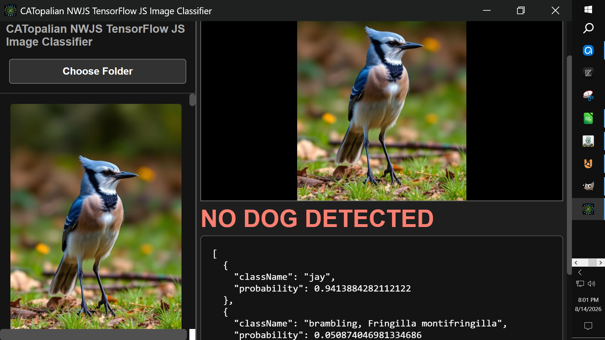

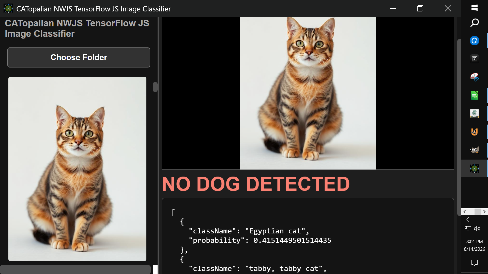

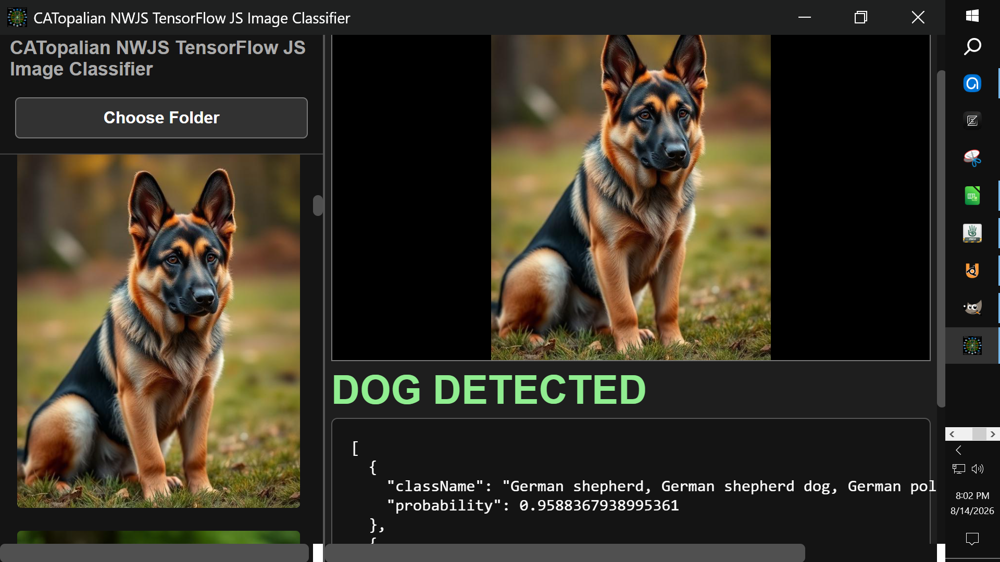

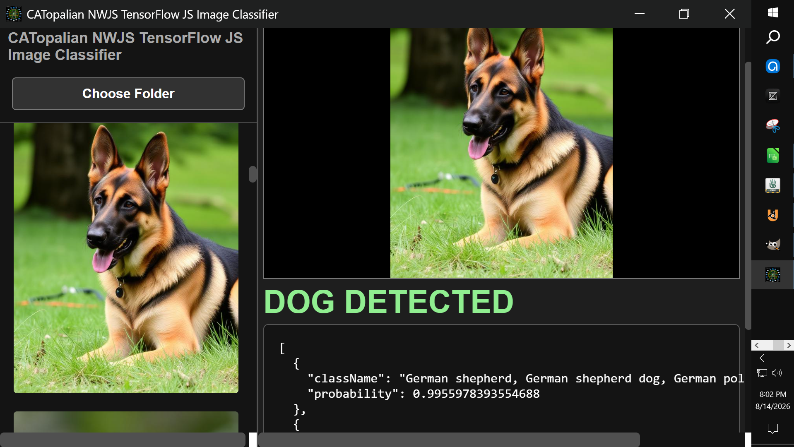

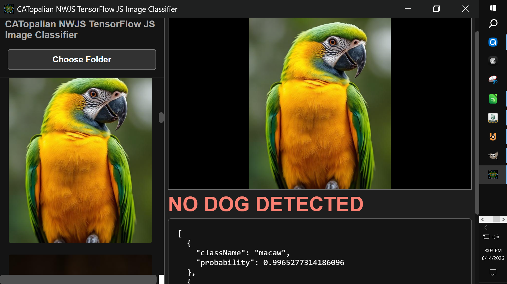

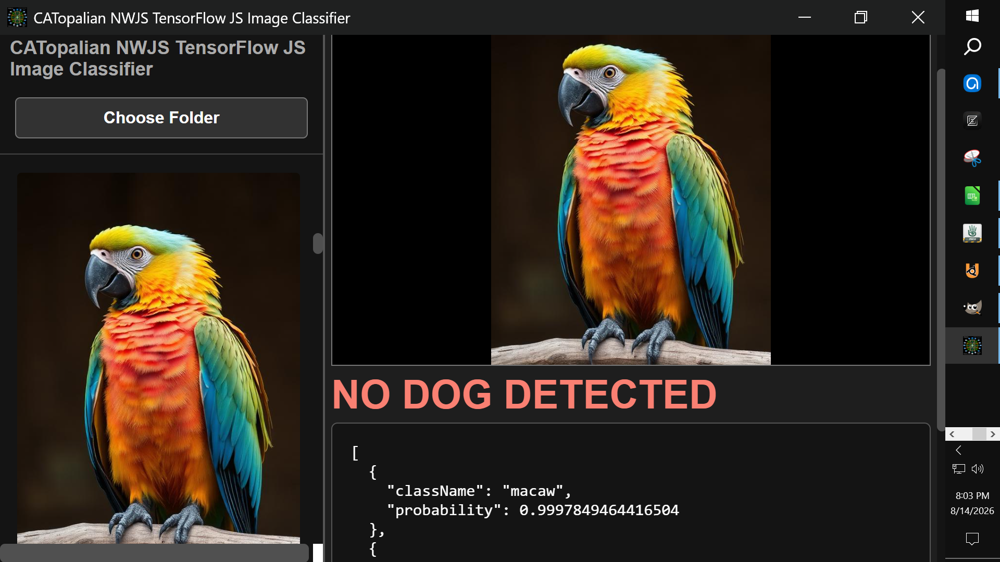

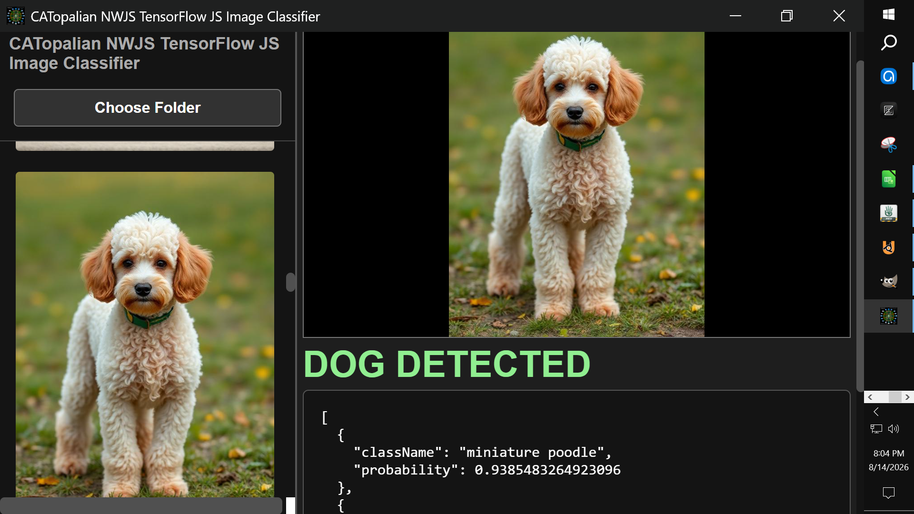

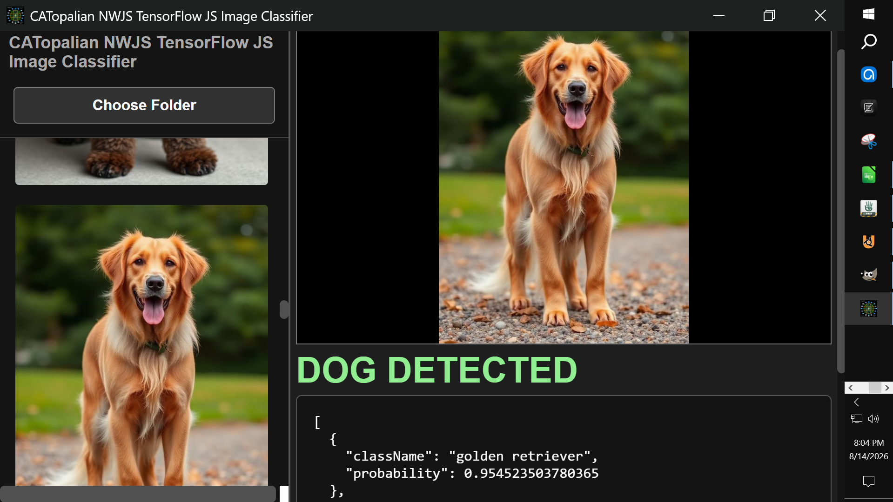

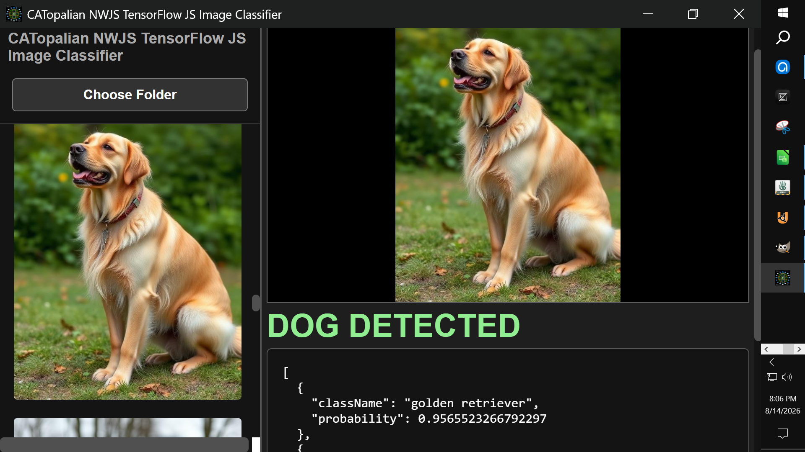

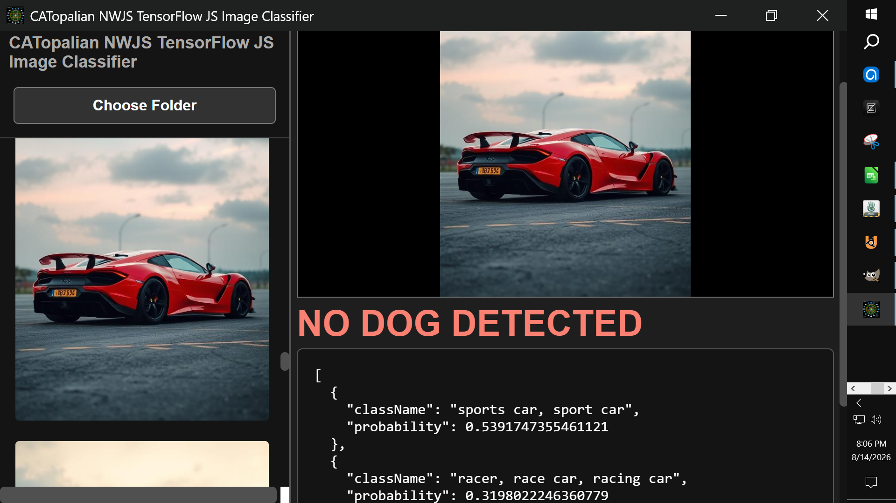

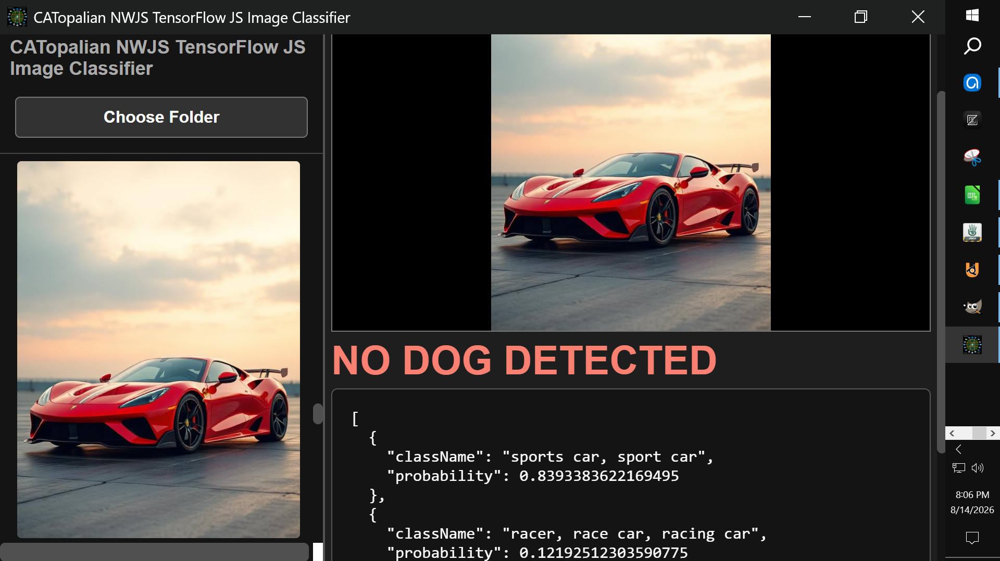

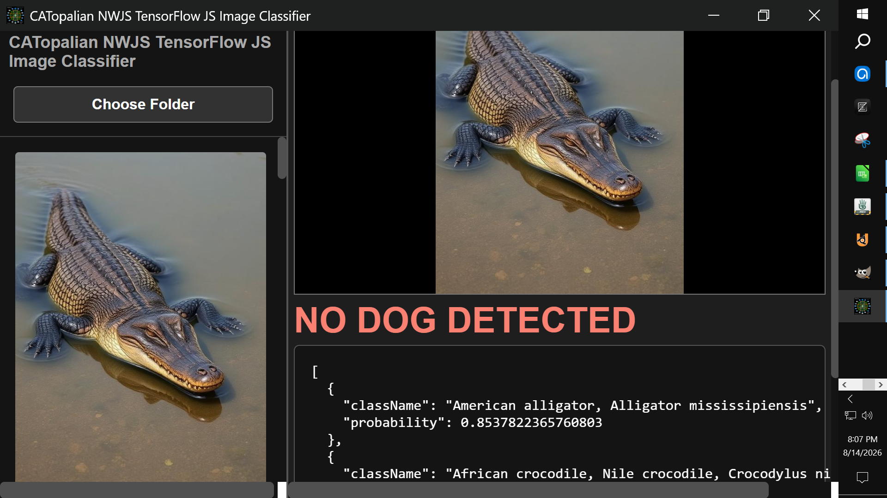

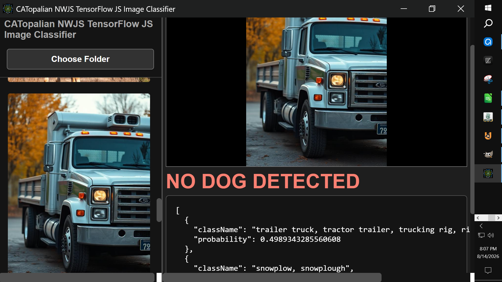

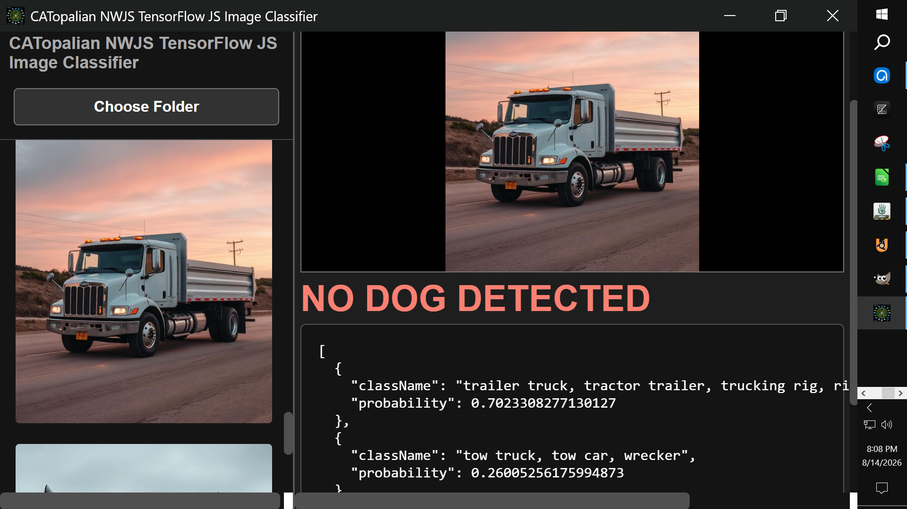

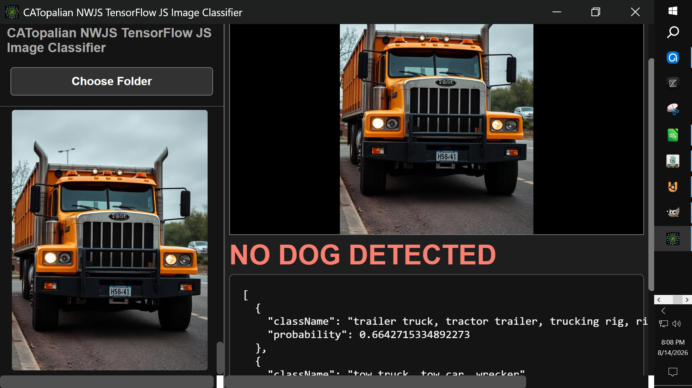

---

### How to Download this App
1. Click the green Code Button on this github page
2. Choose Download ZIP
3. Save the Zip File
4. Extract All
5. Drag the folder named v001 onto the nw.exe icon 

---

Happy Scripting :-)

----

Dedicated to God the Father  
All Rights Reserved Christopher Andrew Topalian Copyright 2000-2026  
https://github.com/ChristopherTopalian  
https://github.com/ChristopherAndrewTopalian  
https://sites.google.com/view/CollegeOfScripting

